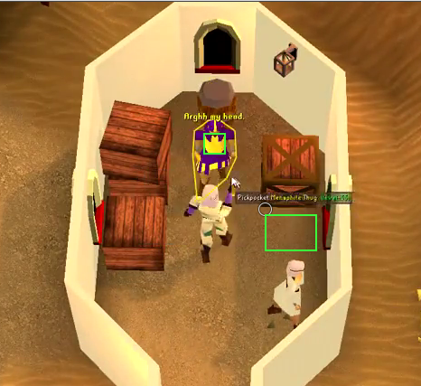

# OSRS Menaphite Thug Blackjacking Script

An AutoHotkey automation script for training Thieving via blackjacking Menaphite Thugs in Old School RuneScape (OSRS).

> ⚠️ **Disclaimer**: Use at your own risk. This script violates OSRS rules (macroing/botting) and may result in a ban. This is for educational purposes only.


## What This Script Does

This script automates the "blackjacking" thieving method in OSRS, which involves:
1. **Knocking out** Menaphite Thugs in Pollnivneach
2. **Pickpocketing** them twice while unconscious
3. **Managing health** by eating food when needed
4. **Safespotting** periodically to reset aggression

### Key Features

- ✅ **Precise timing control** using high-performance counters for consistent 2-tick blackjacking
- ✅ **Randomized delays** to simulate human-like behavior
- ✅ **Visual region overlay** (Ctrl+F12) to see defined areas
- ✅ **Emergency safespot** hotkey (Ctrl+0) for quick escapes
- ✅ **Automatic food consumption** from inventory
- ✅ **Anti-pattern measures** with weighted random distributions

## Requirements

- [AutoHotkey v1.1](https://www.autohotkey.com/) (tested on v1.1, may need adjustments for v2)
- Old School RuneScape (desktop client or RuneLite)
- **Blackjack** (willow or better recommended)
- **Food** in inventory (starting from slot 2)
- Access to **Menaphite Thugs** in Pollnivneach (requires The Feud quest)

## Setup Instructions

### 1. Installation

1. Download and install [AutoHotkey](https://www.autohotkey.com/)
2. Dowload the script, blacjacking.ahk
3. Right-click the file and select **"Run Script"**

### 2. Initial Configuration

You must define **three regions** by holding **Ctrl + Left Click** and dragging:

| Order | Region | Description |
|-------|--------|-------------|
| **1st** | `menaphiteBody` | The Menaphite Thug's body (where you right-click) |
| **2nd** | `safespot` | Your safespot location (where you run to reset aggression) |
| **3rd** | `menaphiteBodyFromSafespot` | The thug's position when viewed from the safespot |

**How to set regions:**
1. Stand next to a Menaphite Thug
2. Hold `Ctrl` and drag a box around the thug's body → release
3. Run to your safespot location
4. Hold `Ctrl` and drag a box around where you're standing → release
5. Face the thug from the safespot
6. Hold `Ctrl` and drag a box around the thug from this angle → release

> 💡 **Tip**: Use `Ctrl+F12` to toggle a visual overlay showing your defined regions as green rectangles.

### 3. Inventory Setup

- Place **food in inventory slot 2** (top-left, second position)
- The script will automatically eat from slot 2, then 3, then 4, etc.
- Ensure you have enough food for your session

## Hotkeys Reference

| Hotkey | Function |
|--------|----------|
| `Ctrl+F11` | **Toggle script ON/OFF** (main control) |
| `Ctrl+F12` | Toggle visual layout overlay (shows defined regions) |
| `Ctrl+F10` | Reload script (if something goes wrong) |
| `Ctrl+F9` | Pause/Unpause script |
| `Ctrl+0` | **Emergency safespot** (immediate escape) |
| `Ctrl+Left Click` | Define regions (hold and drag) |
| `F` | **Force exit** (kills the script instantly) |

## How It Works

### Normal Cycle

```
1. Right-click thug → Select "Knock-Out"
2. Move mouse back to thug
3. Wait ~60-120ms (randomized)
4. Pickpocket (1st time)
5. Wait for precise timing (~580-635ms from start)
6. Pickpocket (2nd time)
7. Wait for precise timing (~1260-1285ms from start)
8. Pickpocket (3rd time)
9. Wait ~1300-1350ms
10. Repeat from step 1
```

### Safespot Cycle (every ~15 minutes)

```
1. Click safespot location (run there)
2. Eat food from inventory
3. Wait 10 seconds (aggression resets)
4. Click "body from safespot" position
5. Knock-out thug
6. Wait for movement
7. Click main body position
8. Resume normal cycle
```

## Technical Details

### Timing Precision

The script uses `QueryPerformanceCounter` for microsecond-precision timing:
- First pickpocket: ~580-635ms after knockout
- Second pickpocket: ~1260-1285ms after knockout
- These timings align with OSRS game ticks for optimal XP rates

### Anti-Detection Measures

- **Randomized mouse speeds** (1-4 variance)
- **Randomized click delays** (50-90ms down/up separation)
- **Gaussian-like distribution** for all random values (clustered around mean)
- **Variable sleep times** between actions
- **Non-constant region clicking** (clicks random point within defined area)

### Region Definition Format

```autohotkey
region := {"x1": 100, "y1": 200, "x2": 150, "y2": 250}
```

## Troubleshooting

### "First define the body, safespot and body from safespot"

You haven't defined all three required regions. Hold `Ctrl` and drag to create:
1. Box around the thug
2. Box around your safespot
3. Box around the thug from the safespot

### Script clicks in wrong places

- Ensure OSRS window is active when defining regions
- Regions are relative to the **window**, not the screen
- Try reloading with `Ctrl+F10` and redefining regions

### "Run out of food"

The script has eaten through all 28 inventory slots. Restock food starting from slot 2 and restart.

### Emergency situations

- Press `Ctrl+0` to force immediate safespot
- Press `F` to kill the script entirely
- Press `Ctrl+F9` to pause temporarily

## Customization

### Adjusting Timing

Edit these values in the `script()` function:

```autohotkey
firstPicpoketTime := randomValue(580, 635)   ; First pickpocket timing
secondPicpoketTime := randomValue(1260, 1285) ; Second pickpocket timing
```

### Changing Safespot Interval

Edit the `safespotCountdown()` call (time in milliseconds):

```autohotkey
safespotCountdown(900000)  ; 900000ms = 15 minutes
```

### Changing Food Slot

Edit `cellWithFood` in the `safespoting()` function (default starts at slot 2):

```autohotkey
static cellWithFood := 2  ; Change to 1 for first slot, etc.
```

## File Structure

```
blackjack.ahk
├── Configuration Section (hotkeys, globals)
├── Main Loop (script())
├── Core Actions (pickPocket, knockOut, safespoting)
├── Region Management (makeRegion, loadInventory)
└── Utility Library (randomValue, clicRegion, etc.)
```

## Safety Tips

1. **Start with short sessions** (30-60 minutes)
2. **Use breaks** every 2 hours maximum
3. **Monitor the game** - don't leave completely unattended
4. **Have emergency keys ready** (Ctrl+0 and F)
5. **Test in a safe area first** before using in Pollnivneach

## Known Limitations

- Designed for **fixed window size** - resizing OSRS window requires redefining regions
- Menu option positions are hardcoded
- Requires **visible inventory** (script detects inventory position automatically)
- May need adjustment for different screen resolutions/scaling
